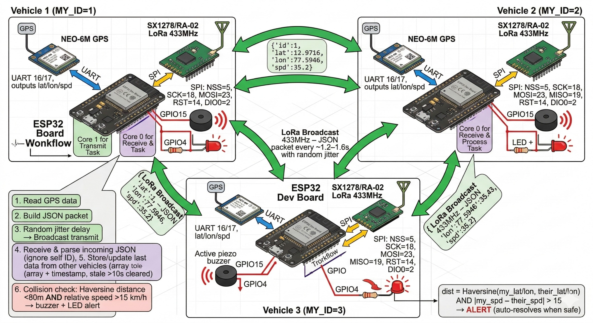

# V2V Communication System (Vehicle-to-Vehicle)

A decentralized, internet-independent Vehicle-to-Vehicle (V2V) safety communication system using LoRa wireless networking. Three or more vehicles equipped with ESP32 boards exchange GPS position and velocity data to detect collision risks in real-time.

## Block Diagram

<div align="center">
  
</div>

## System Overview

**Architecture:** Three-node LoRa mesh network with dual-core ESP32 task distribution
- **Vehicle 1 (MY_ID=1):** Primary transmitter - reads GPS and broadcasts location/Speed
- **Vehicle 2 (MY_ID=2):** Receiver & Processor - monitors incoming traffic and triggers alerts
- **Vehicle 3 (MY_ID=3):** Development/monitoring station with alert outputs

**Collision Detection:** Haversine-based distance calculation + relative velocity analysis
- **Alert Trigger:** Distance < 80m AND relative speed > 15 km/h
- **Output:** Piezo buzzer + LED indicators
- **Auto-Recovery:** Alert automatically resolves when vehicles are safe

---

## Hardware Components

### Per Vehicle Unit
| Component | Model | Connection | Purpose |
|-----------|-------|-----------|---------|
| Microcontroller | ESP32 Dev Module | - | Main processor (dual-core: 240 MHz each) |
| GPS Module | NEO-6M | UART 16/17 @ 9600 baud | Global positioning + velocity vector |
| LoRa Module | SX1278/RA-02 | SPI + control pins | 433 MHz RF communication |
| Antenna | Dipole/Helical | - | LoRa RF amplification |
| Status LED | Generic RGB/Single | GPIO15 | Visual feedback |
| Buzzer (optional) | Active Piezo | GPIO4 | Audible collision warning |

### SPI Pin Mapping
| Signal | GPIO | Function |
|--------|------|----------|
| NSS (CS) | 5 | Chip Select |
| SCK | 18 | Serial Clock |
| MOSI | 23 | Master Out, Slave In |
| MISO | 19 | Master In, Slave Out |
| RST | 14 | LoRa Module Reset |
| DIO0 | 2 | LoRa Interrupt (RX Ready) |

### GPS UART Configuration
| Pin | Function |
|-----|----------|
| GPIO16 | RX (receive GPS NMEA data) |
| GPIO17 | TX (unused at 9600 baud) |
| Baud | 9600 |

---

## Software Architecture

### Core Task Distribution (ESP32 Dual-Core)

**Core 1 - Transmit Task (Vehicle 1 & 2):**
```
Loop:
  1. Read GPS data (latitude, longitude, speed from NEO-6M)
  2. Build JSON packet: {"id": MY_ID, "lat": X.XXXX, "lon": Y.YYYY, "spd": Z.Z}
  3. Apply random jitter delay (varies per cycle)
  4. Transmit via LoRa (433 MHz broadcast)
  5. Wait ~1.2-1.6s before next cycle
```

**Core 0 - Receive & Process Task (Vehicle 2 & 3):**
```
Loop:
  1. Listen for incoming LoRa packets (433 MHz)
  2. Parse received JSON from other vehicles
  3. Update local array with latest position/velocity data
  4. Timestamp each entry (clear stale data >10 seconds old)
  5. Ignore packets from own vehicle ID
  6. Execute collision detection logic:
     - Calculate Haversine distance to each tracked vehicle
     - Compute relative velocity
     - If (distance < 80m AND rel_velocity > 15 km/h):
       → Trigger buzzer (GPIO4)
       → Activate LED (GPIO15)
       → Log alert event
     - Else if previously alerted:
       → Clear alert (buzzer off, LED off)
```

### Communication Protocol

**Broadcast Format (JSON):**
```json
{
  "id": 1,
  "lat": 12.9716,
  "lon": 77.5946,
  "spd": 35.2
}
```

**Transmission Details:**
- Frequency: 433 MHz (ISM band)
- Interval: ~1.2-1.6 seconds per packet (includes random jitter)
- Range: ~400-500m line-of-sight (outdoor)
- All transmissions are broadcast (received by all nodes in range)

---

## Collision Detection Logic

### Haversine Distance Formula
Calculates great-circle distance between two GPS coordinates:

```
a = sin²(Δlat/2) + cos(lat1) × cos(lat2) × sin²(Δlon/2)
c = 2 × atan2(√a, √(1−a))
distance = R × c  (R = 6371 km for Earth radius)
```

### Relative Velocity Analysis
- Extract velocity vectors from each vehicle's LoRa packet
- Compute vector difference to get approach/recession rate
- Alert only if vehicles are actively approaching (rel_velocity > 15 km/h)

### Alert Trigger Conditions
**ALL of the following must be true:**
1. Haversine distance < 80 meters
2. Relative approach speed > 15 km/h
3. GPS fix valid on both vehicles

**Output Actions:**
- GPIO4 (Buzzer): 500 Hz tone, 100 ms bursts
- GPIO15 (LED): Solid red or pulsing pattern
- Serial log: Event timestamp + vehicle IDs + distance + speed

**Auto-Resolve:**
- When distance > 100m OR relative speed ≤ 10 km/h
- 2-second hysteresis to avoid flicker

---

## Project Structure

```
V2V-Comm-System/
├── README.md                          # This file
├── docs/
│   └── block_diagram.txt             # System architecture summary
│
├── lora_gps_test/                    # Integrated GPS + LoRa sketches
│   ├── lora_gps_test_transmitter/
│   │   └── lora_gps_test_transmitter.ino
│   └── lora_gps_test_receiver/
│       └── lora_gps_test_receiver.ino
│
├── lora_test/                        # Basic LoRa communication tests
│   ├── lora_test_01/
│   │   └── lora_test_01.ino         # Basic transmitter test
│   └── lora_test_02/
│       └── lora_test_02.ino         # Basic receiver test
│
└── .git/                            # Git version control
```

---

## Sketch Details

### lora_gps_test_transmitter.ino
- **Core 1:** Reads NEO-6M GPS via UART, builds JSON, transmits via LoRa
- **MY_ID:** Vehicle 1 (configurable)
- **Output:** Serial debug @ 115200 baud
- **Key Functions:**
  - `readGPSData()`: Parse NMEA sentences from GPS module
  - `buildJSONPacket()`: Construct JSON with id/lat/lon/spd fields
  - `transmitLoRa()`: Send packet via SX1278 module

### lora_gps_test_receiver.ino
- **Core 0:** Listens for LoRa packets, parses JSON, checks collision risk
- **MY_ID:** Vehicle 2 (configurable)
- **Outputs:** 
  - Serial debug @ 115200 baud
  - GPIO4 (buzzer) for alerts
  - GPIO15 (LED) for visual feedback
- **Data Structure:** Array of vehicle records with timestamp
- **Key Functions:**
  - `receiveLoRa()`: Listen for incoming packets
  - `parseJSONPacket()`: Extract id/lat/lon/spd from received data
  - `checkCollisionRisk()`: Haversine distance + velocity calculation
  - `triggerAlert()`: Activate buzzer/LED outputs

### lora_test_01.ino & lora_test_02.ino
- Simplified LoRa transmit/receive tests (no GPS integration)
- Used for debugging LoRa hardware and RF communication path
- Useful for initial hardware validation before integrating GPS

---

## Getting Started

### 1. Hardware Setup
1. **ESP32 Board:** Install USB driver and connect via micro-USB
2. **NEO-6M GPS Module:**
   - Connect VCC → 3.3V
   - Connect GND → GND
   - Connect TX → GPIO17
   - Connect RX → GPIO16
3. **SX1278 LoRa Module:**
   - Connect VCC → 3.3V
   - Connect GND → GND
   - Connect SPI pins per table above
   - Connect RST → GPIO14
   - Connect DIO0 → GPIO2
4. **Antenna:** Solder dipole or helical antenna to LoRa module
5. **Buzzuner & LED (optional):**
   - Buzzer: +5V → GPIO4 resistor (200Ω) → module pin
   - LED: GPIO15 → 220Ω resistor → GND

### 2. Arduino IDE / PlatformIO Setup
- **Board:** ESP32 Dev Module
- **CPU Frequency:** 80 MHz (or 160 MHz for faster SPI)
- **Upload Speed:** 921600 baud
- **Flash Size:** 4 MB (or 8 MB)
- **Baud Rate (Serial Monitor):** 115200

### 3. Library Dependencies
- **LoRa (by Sandeep Mistry):** `https://github.com/sandeepmistry/arduino-LoRa`
- **TinyGPSPlus:** `https://github.com/mikalhart/TinyGPSPlus`

Install via Arduino IDE Sketch → Include Library → Manage Libraries

### 4. Configuration & Upload
1. Edit `MY_ID` variable in sketch (1, 2, or 3 for each vehicle)
2. Compile and upload to ESP32
3. Open Serial Monitor @ 115200 baud
4. Verify GPS data appearing (NMEA sentences) and LoRa TX/RX activity

### 5. Testing
- **Single Vehicle:** Upload transmitter sketch, verify GPS + LoRa TX on Serial Monitor
- **Two Vehicles:** Upload transmitter to Vehicle 1, receiver to Vehicle 2
  - Move vehicles apart/together while monitoring Serial output
  - Verify JSON packets received and parsed correctly
  - Position vehicles within 80m and accelerate toward each other
  - Observe buzzer/LED alerts when collision criteria met
- **Three Vehicles:** Add development board with receiver sketch for centralized monitoring

---

## Troubleshooting

| Issue | Cause | Solution |
|-------|-------|----------|
| GPS shows no fix | Cold start / weak signal | Allow 30-60 seconds outdoors, clear sky view |
| LoRa TX/RX not working | Antenna disconnected or SPI pins wrong | Check antenna connection and SPI GPIO mapping |
| JSON parsing errors | Corrupted packet or incomplete transmission | Add checksums or CRC validation |
| Alert triggers incorrectly | Haversine formula or relative velocity bug | Validate with known GPS coordinates and speed vectors |
| ESP32 resets randomly | Low power supply or corrupted SPIFFS | Ensure stable 3.3V supply, use quality power bank |
| Buzzer/LED not responding | GPIO output high/low logic reversed | Check polarity and test with digitalWrite(GPIO, HIGH/LOW) |

---

## Future Enhancements

- [ ] **Zigbee/BLE fallback** when LoRa unavailable
- [ ] **Multi-hop relay** for extended range beyond direct LoRa
- [ ] **Encrypted communication** using AES-128 for security
- [ ] **Persistent logging** to onboard SPIFFS or SD card
- [ ] **OLED display** for real-time vehicle dashboard
- [ ] **Speed/lane prediction** using Kalman filters
- [ ] **Web dashboard** for remote monitoring (via WiFi gateway)
- [ ] **CAN bus integration** for vehicle telemetry (OBD2 bridge)

---

## References

- [Arduino LoRa Documentation](https://github.com/sandeepmistry/arduino-LoRa)
- [ESP32 Datasheet](https://www.espressif.com/sites/default/files/documentation/esp32_datasheet_en.pdf)
- [SX1278 LoRa Module Specification](http://wiki.ai-thinker.com/ra-02)
- [Haversine Formula](https://en.wikipedia.org/wiki/Haversine_formula)
- [NEO-6M GPS Module Guide](https://www.u-blox.com/en/product/neo-6-series)

---

## License & Contributing

Open source for educational and research purposes. Contributions welcome via pull requests.

**Last Updated:** March 2026
**Status:** Core communication working | Collision detection in testing | Multi-vehicle ready

## License
Choose a license before public release (MIT is common for embedded prototypes).
